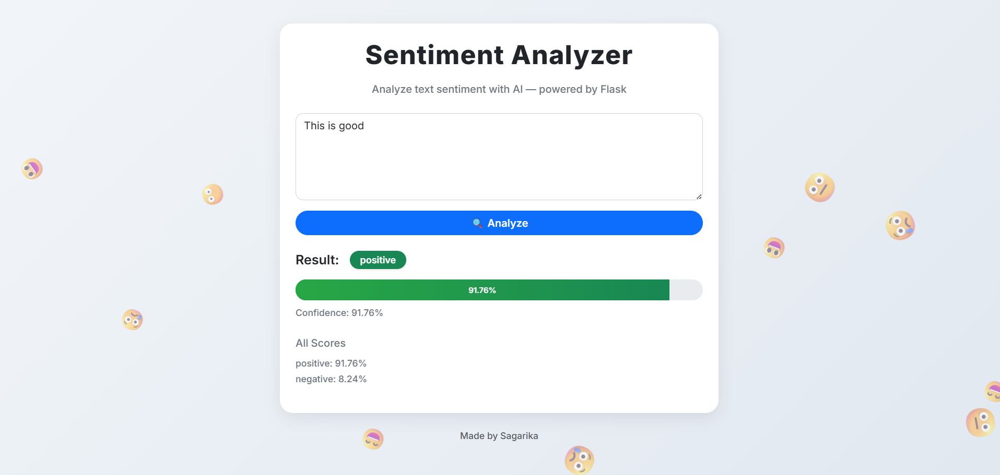
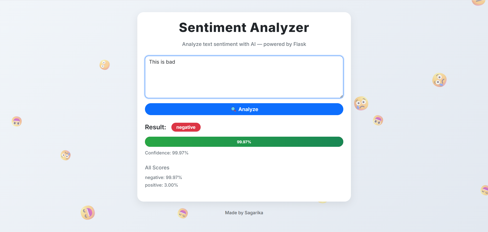

# Sentiment Analyzer

Analyze text sentiment with AI — powered by **Flask**, **scikit-learn**, and a clean interactive UI.

---

## 🚀 Features

* 🌐 Web interface (Flask + Bootstrap + custom CSS)
* 🎨 Floating emoji animations for an engaging UI
* 🧠 Machine Learning model training with **train.py**
* 📊 Confidence scores & probability distribution for all labels
* ⌨️ Keyboard shortcut: **Ctrl+Enter / Cmd+Enter** to analyze
* 🔧 Robust API with tolerant response parsing

---

## 🛠️ Tech Stack

**Frontend**

* HTML5, CSS3, JavaScript (Vanilla JS)
* Bootstrap 5
* Google Fonts: Inter

**Backend**

* Python 3 (Flask, Flask-CORS)
* scikit-learn (ML pipeline)
* NumPy & Pandas
* NLTK (text preprocessing)
* Joblib (model persistence)
* Gunicorn (for production deployment)

---

## 📂 Project Structure

```
Sentiment-Analyzer/
│
├── app.py                # Flask backend
├── train.py              # Script to train model & save pipeline.pkl
├── preprocess.py         # Preprocessing utilities
├── models/
│   └── pipeline.pkl      # Trained ML model
├── templates/
│   └── index.html        # Frontend HTML
├── static/
│   ├── style.css         # Custom CSS
│   └── app.js            # Frontend JS
├── screenshots/
│   ├── positive.png      # Example positive prediction
│   └── negative.png      # Example negative prediction
├── requirements.txt      # Python dependencies
└── README.md             # Project documentation
```

---

## ⚙️ Installation & Setup

1. **Clone repository**

   ```bash
   git clone https://github.com/your-username/Sentiment-Analyzer.git
   cd Sentiment-Analyzer
   ```

2. **Create & activate virtual environment**

   ```bash
   python -m venv venv
   source venv/bin/activate   # Linux/Mac
   venv\Scripts\activate      # Windows
   ```

3. **Install dependencies**

   ```bash
   pip install -r requirements.txt
   ```

4. **Train the model** (generates `models/pipeline.pkl`)

   ```bash
   python train.py
   ```

5. **Run the Flask app**

   ```bash
   python app.py
   ```

   Visit 👉 [http://localhost:5000](http://localhost:5000)

6. **Production (Gunicorn example)**

   ```bash
   gunicorn -w 4 app:app
   ```

---

## 📡 API Endpoint

**POST** `/api/predict`

### Request Body:

```json
{
  "text": "I love this project!"
}
```

### Response Example:

```json
{
  "sentiment": "positive",
  "confidence": 92.45,
  "all_scores": {
    "positive": 92.45,
    "negative": 7.55
  }
}
```

---

## 📸 Screenshots

### Positive Sentiment



### Negative Sentiment



---


## 👩‍💻 Author

Made by **Sagarika**
